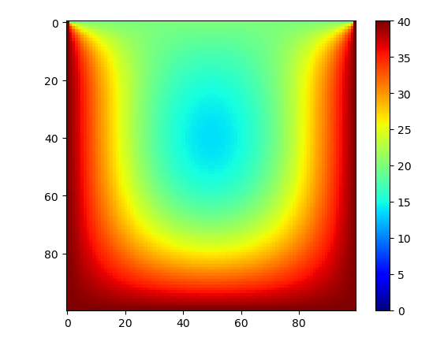
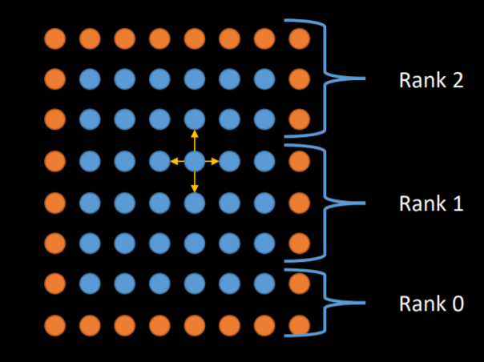

# laplacian-equation

The Laplacian (or Poisson) equation of temperature distribution can be numerical solved by using five point stencil method (for the PDE part) and  Euler's method (for the ODE part). 

Also, there is another numerical method. We can assume that every iteration of the evolution of temperature satisfies the Laplace condition

$${\displaystyle \nabla ^{2}f=0.}$$

Therefore, the value of a elements in the temperature matrix can be regarded as follows:

$$
4 T_{i, j}(t)= T_{i-1, j}(t-1)+T_{i+1, j}(t-1)+T_{i, j-1}(t-1)+T_{i, j+1}(t-1)
$$


After enough iteration times, the result will be the same as the result of the first method.

Both of these two methods' serial code can be seen in follows files:

<a href="https://github.com/Zhou-Shu/5001HW2/blob/main/laplacian_eq.py">laplacian_eq.py</a>


_The result of 100*100 matix after 1000 iterations_:




However, using python to do the computation is too slow. Therefore I choosen using c to do this task.

The makefile, source code, and executable file can be found as follows:

<a href="https://github.com/Zhou-Shu/5001HW2/blob/main/makefile">makefile</a>
<a href="https://github.com/Zhou-Shu/5001HW2/blob/main/laplacian_eq.h">laplacian_eq.h</a>
<a href="https://github.com/Zhou-Shu/5001HW2/blob/main/laplacian_eq.c">laplacian_eq.c</a>
<a href="https://github.com/Zhou-Shu/5001HW2/blob/main/laplacian_eq.exe">laplacian_eq.exe</a>

The environment configurations are

```shell

windows 10
intel i7-10750H 
6 cores
mpiexec (OpenRTE) 3.1.6
gcc 版本 10.2.0 (GCC)
GNU Make 4.3
CYGWIN_NT-10.0
```

_( For Linux or windows, MAC OS may cannot compile or run successfully, because of the difference of gcc and the head file <sys/time.h> )_


The basic idea of my parallel code is creating a one dim acyclic communicator first, and then split the task as follows: 



As in every iteration the value of boundary elements depends on others processes, it requires communication at every iteration, which may cause deadlocks. 

To solve this problem, I have tried multiple methods (e.g. copy the msg to some buffers by using MPI_Bsend and let process 0 to deal with it in the background). 

However, in the end, I chose a more intuitive approach, which is spliting the processes as two groups (odd rank group and even rank group), then let one group send msg first, recv msg later, while another group recv msg first and send msg later.

After finish all the computation, the collective communication func MPI_Gatherv are applied to get all the information.


## Command lines:

serial execution: 

```shell
mpiexec -n 1 laplacian_eq.exe --serial

or

mpiexec -n 1 laplacian_eq.exe -s
```

parallel execution: 

```shell
mpiexec -n 5 laplacian_eq.exe --parallel

or

mpiexec -n 5 laplacian_eq.exe -p
```

serial execution and print results:

```shell
mpiexec -n 1 laplacian_eq.exe --serial=p

or

mpiexec -n 1 laplacian_eq.exe -sp
```


parallel execution and print results:

```shell
mpiexec -n 5 laplacian_eq.exe --parallel=p

or

mpiexec -n 5 laplacian_eq.exe -pp
```

## Result

The improvement is not significant when matrix is small

1000*1000 matrix and 1000 iterations:

```shell
//serial
$ mpiexec -n 1 laplacian_eq.exe -s
time=4.7579890000

//parallel
$ mpiexec -n 5 laplacian_eq.exe -p
time=3.2698950000
```

However, when the matrix become large, the parallel code showed a huge improvement.

10000*10000 matrix and 1000 iteration:

```shell
// serial
$ mpiexec -n 1 laplacian_eq.exe -s
time=390.9852980000

//parallel
$ mpiexec -n 6 laplacian_eq.exe -p
time=110.5232600000
```
